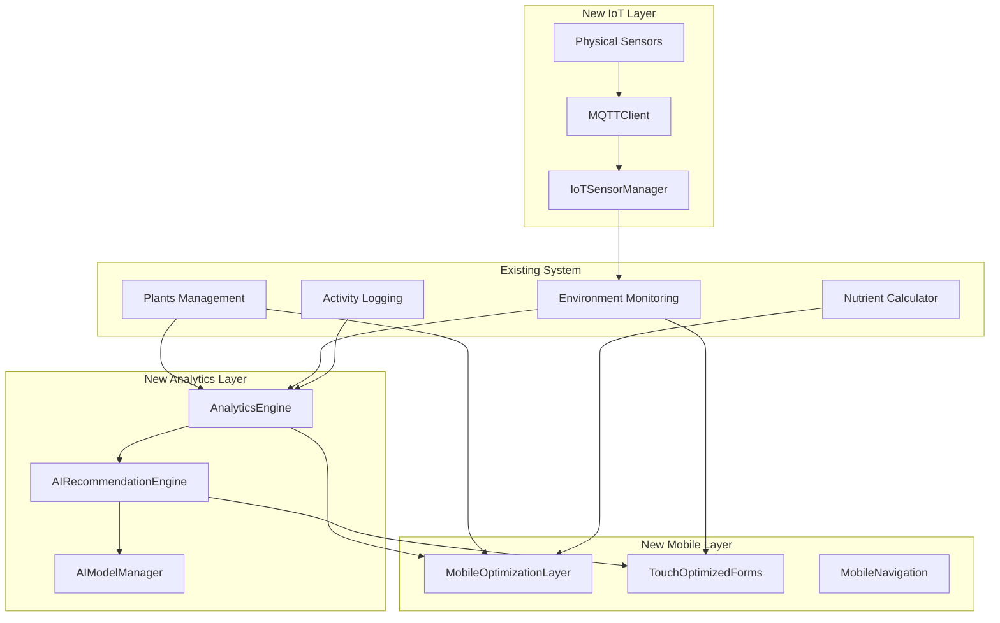

# Emerald Plant Tracker Brownfield Enhancement Architecture

## Introduction

This document outlines the architectural approach for enhancing Emerald Plant Tracker with advanced analytics, AI-powered recommendations, mobile optimization, and IoT sensor integration. Its primary goal is to serve as the guiding architectural blueprint for AI-driven development of new features while ensuring seamless integration with the existing system.

**Relationship to Existing Architecture:**
This document supplements existing project architecture by defining how new components will integrate with current systems. Where conflicts arise between new and existing patterns, this document provides guidance on maintaining consistency while implementing enhancements.

### Existing Project Analysis

**Current Project State:**

- **Primary Purpose:** Self-hosted cannabis cultivation management with advanced nutrient calculation, environmental monitoring, and plant tracking capabilities
- **Current Tech Stack:** Full-stack JavaScript with React 19.1 frontend, Node.js 22/Express.js 5.1 backend, PostgreSQL 16 database, Bun build system
- **Architecture Style:** Monolithic full-stack application with RESTful API, single-container Docker deployment
- **Deployment Method:** Docker containerization with multi-stage Alpine Linux builds, self-hosted privacy-focused approach

**Available Documentation:**

- Comprehensive README with feature documentation and deployment instructions
- Technical migration summaries (SQLite to PostgreSQL, CRACO to Bun)
- Domain-specific vendor feeding charts and CSV import guides
- Docker configuration and development helper scripts
- Warp terminal rules for development workflow

**Identified Constraints:**

- Single-container Docker architecture limits horizontal scaling options
- Cannabis-themed port 420 may conflict with enterprise deployment requirements
- Self-hosted requirement eliminates cloud-based AI/ML service options
- Bun build system is relatively new with potential dependency compatibility issues
- PostgreSQL migration complexity requires careful schema evolution planning

### Change Log

| Change               | Date       | Version | Description                                                    | Author      |
| -------------------- | ---------- | ------- | -------------------------------------------------------------- | ----------- |
| Initial Architecture | 2025-07-03 | v1.0    | Established brownfield architecture for systematic enhancement | BMAD System |

## Enhancement Scope and Integration Strategy

### Enhancement Overview

**Enhancement Type:** Multi-faceted system enhancement including analytics, AI recommendations, mobile optimization, and IoT integration
**Scope:** Comprehensive feature additions with architectural improvements while maintaining existing functionality
**Integration Impact:** Significant architectural changes with new service layers and data processing pipelines

### Integration Approach

**Code Integration Strategy:** Extend existing React/Express patterns with new service layers for analytics and AI processing. Implement microservice-like separation within monolithic structure using clear module boundaries.

**Database Integration:** Expand PostgreSQL schema with new tables for analytics, AI models, and IoT data while maintaining existing table structures and relationships. Use database migrations for safe schema evolution.

**API Integration:** Create versioned API endpoints (v1/v2) to maintain backward compatibility while adding enhanced functionality. Implement new API modules following existing Express.js route patterns.

**UI Integration:** Develop responsive React components using established design patterns and component libraries. Extend existing routing and state management without disrupting current user workflows.

### Compatibility Requirements

- **Existing API Compatibility:** All current REST endpoints maintain identical request/response schemas
- **Database Schema Compatibility:** New tables and columns added without modifying existing structures
- **UI/UX Consistency:** Enhanced interfaces follow established dark theme and cannabis-focused design language
- **Performance Impact:** New features operate within existing performance constraints (<2s page loads, <100ms API responses)

## Tech Stack Alignment

### Existing Technology Stack

| Category       | Current Technology  | Version    | Usage in Enhancement  | Notes                           |
| :------------- | :------------------ | :--------- | :-------------------- | :------------------------------ |
| **Language**   | JavaScript (ES2022) | Latest     | All new components    | Maintain modern JS standards    |
| **Runtime**    | Node.js             | 22         | Backend services      | LTS version for stability       |
| **Framework**  | React               | 19.1       | Frontend components   | Latest with concurrent features |
| **Backend**    | Express.js          | 5.1        | API and middleware    | Proven REST API foundation      |
| **Database**   | PostgreSQL          | 16         | All data storage      | Recently migrated from SQLite   |
| **Build Tool** | Bun                 | Latest     | Build and dev server  | 150x faster than previous setup |
| **UI Library** | Lucide React        | Latest     | Iconography           | Consistent icon system          |
| **Charts**     | Chart.js/Recharts   | 4.5/Latest | Data visualization    | Dual library approach           |
| **Forms**      | React Hook Form     | 7.54       | Form management       | Established form patterns       |
| **OCR**        | Tesseract.js        | Latest     | Image text extraction | Specialized functionality       |
| **Container**  | Docker              | Latest     | Deployment            | Multi-stage Alpine builds       |

### New Technology Additions

| Technology    | Version | Purpose           | Rationale                                 | Integration Method           |
| :------------ | :------ | :---------------- | :---------------------------------------- | :--------------------------- |
| TensorFlow.js | Latest  | AI/ML Processing  | Client-side AI without cloud dependencies | Embedded in React components |
| MQTT.js       | Latest  | IoT Communication | Standard IoT protocol support             | Node.js backend service      |
| Socket.io     | Latest  | Real-time Updates | Live sensor data and notifications        | WebSocket layer over Express |
| React Query   | Latest  | State Management  | Enhanced data fetching for analytics      | React hooks integration      |

## Data Models and Schema Changes

### New Data Models

### AnalyticsData

**Purpose:** Store processed cultivation insights and calculated metrics for dashboard display
**Integration:** References existing plants, environment, and logs tables for source data

**Key Attributes:**

- analytics_id: SERIAL PRIMARY KEY - Unique identifier for analytics records
- plant_id: INTEGER - Foreign key to existing plants table
- calculation_date: TIMESTAMPTZ - When analytics were calculated
- yield_prediction: DECIMAL - Predicted yield based on historical data
- growth_rate: DECIMAL - Calculated growth rate metrics
- environmental_efficiency: JSONB - Environmental optimization scores
- recommendations: JSONB - AI-generated cultivation recommendations

**Relationships:**

- **With Existing:** References plants, environment, logs tables for source data
- **With New:** Links to ai_models and iot_sensors for enhanced analytics

### IoTSensors

**Purpose:** Manage IoT sensor configurations and connection metadata
**Integration:** Provides automated data input to existing environment table

**Key Attributes:**

- sensor_id: SERIAL PRIMARY KEY - Unique sensor identifier
- sensor_name: VARCHAR(255) - Human-readable sensor name
- sensor_type: VARCHAR(100) - Type of sensor (temperature, humidity, etc.)
- protocol: VARCHAR(50) - Communication protocol (MQTT, HTTP, WebSocket)
- connection_config: JSONB - Protocol-specific connection parameters
- grow_tent: VARCHAR(255) - Associated grow tent for data assignment
- last_reading: TIMESTAMPTZ - Timestamp of most recent data
- is_active: BOOLEAN - Sensor operational status

**Relationships:**

- **With Existing:** Populates environment table with automated readings
- **With New:** Links to sensor_data for historical tracking

### AIModels

**Purpose:** Store AI model metadata and training parameters for cultivation recommendations
**Integration:** Uses existing cultivation data for model training and inference

**Key Attributes:**

- model_id: SERIAL PRIMARY KEY - Unique model identifier
- model_name: VARCHAR(255) - Descriptive model name
- model_type: VARCHAR(100) - Type of AI model (recommendation, prediction, etc.)
- training_data_period: DATERANGE - Data range used for training
- model_parameters: JSONB - Model configuration and weights
- accuracy_metrics: JSONB - Model performance statistics
- last_trained: TIMESTAMPTZ - Most recent training timestamp
- is_active: BOOLEAN - Model deployment status

**Relationships:**

- **With Existing:** Trained on plants, environment, logs historical data
- **With New:** Generates analytics_data recommendations

### Schema Integration Strategy

**Database Changes Required:**

- **New Tables:** analytics_data, iot_sensors, ai_models, sensor_data, custom_formulations
- **Modified Tables:** Add analytics_enabled flag to plants, iot_integration to environment
- **New Indexes:** Composite indexes on plant_id+calculation_date, sensor_id+timestamp
- **Migration Strategy:** Sequential migrations with rollback procedures and data validation

**Backward Compatibility:**

- All existing tables remain unchanged in structure and constraints
- New columns added with DEFAULT values to prevent application disruption
- Foreign key relationships use existing primary keys without modification

## Component Architecture

### New Components

### AnalyticsEngine

**Responsibility:** Process historical cultivation data into actionable insights and trends
**Integration Points:** Reads from plants/environment/logs tables, writes to analytics_data table

**Key Interfaces:**

- processHistoricalData(plantId, dateRange) - Generate analytics for specific plant/period
- calculateYieldPrediction(plantData, environmentalData) - AI-powered yield forecasting
- generateRecommendations(analyticsData) - Create cultivation optimization suggestions

**Dependencies:**

- **Existing Components:** Database layer, existing data models
- **New Components:** AIModelManager, DataProcessor

**Technology Stack:** Node.js service with TensorFlow.js for AI processing

### IoTSensorManager

**Responsibility:** Manage IoT sensor connections, data collection, and validation
**Integration Points:** Writes to environment table using existing schema, manages sensor configurations

**Key Interfaces:**

- configureSensor(sensorConfig) - Add new IoT sensor to system
- collectSensorData() - Automated data collection from all active sensors
- validateSensorReading(reading) - Data validation before database storage
- handleSensorFailure(sensorId) - Error handling and notification

**Dependencies:**

- **Existing Components:** Environment data models, notification system
- **New Components:** MQTTClient, WebSocketManager

**Technology Stack:** Node.js with MQTT.js, Socket.io for real-time communication

### MobileOptimizationLayer

**Responsibility:** Provide responsive UI components and touch-optimized interfaces
**Integration Points:** Wraps existing React components with responsive behavior

**Key Interfaces:**

- ResponsiveWrapper(component) - Add mobile responsiveness to existing components
- TouchOptimizedForm(formConfig) - Mobile-friendly form interfaces
- MobileNavigation() - Collapsible navigation for mobile devices

**Dependencies:**

- **Existing Components:** All existing React components and pages
- **New Components:** ResponsiveUtilities, TouchGestureHandler

**Technology Stack:** React 19.1 with CSS Grid/Flexbox, React Hook Form integration

### AIRecommendationEngine

**Responsibility:** Generate intelligent cultivation recommendations using historical data analysis
**Integration Points:** Analyzes existing cultivation data, displays recommendations in UI

**Key Interfaces:**

- generateRecommendations(plantId) - Create personalized cultivation advice
- processModelTraining() - Update AI models with new cultivation data
- validateRecommendation(recommendation) - Ensure recommendation safety and accuracy

**Dependencies:**

- **Existing Components:** Plant tracking, environmental monitoring, nutrient calculator
- **New Components:** AnalyticsEngine, AIModelManager

**Technology Stack:** TensorFlow.js for client-side AI, React components for UI display

### Component Interaction Diagram



## API Design and Integration

### New API Endpoints

**API Integration Strategy:** RESTful endpoints following existing Express.js patterns with versioning support
**Authentication:** Integrate with existing session/token-based authentication
**Versioning:** Implement /api/v2/ namespace for enhanced features while maintaining /api/v1/ compatibility

#### Analytics API

- **Method:** GET
- **Endpoint:** /api/v2/analytics/dashboard/:plantId
- **Purpose:** Retrieve comprehensive analytics data for dashboard display
- **Integration:** Aggregates data from analytics_data table with existing plant information

**Request:**

```json
{
  "plantId": "integer",
  "dateRange": "optional date range",
  "includeRecommendations": "boolean"
}
```

**Response:**

```json
{
  "plantId": 123,
  "analytics": {
    "yieldPrediction": 245.5,
    "growthRate": 1.2,
    "environmentalEfficiency": 0.85,
    "recommendations": [
      {
        "type": "nutrient",
        "message": "Increase CalMag by 15% for optimal growth",
        "confidence": 0.92
      }
    ]
  },
  "trends": {
    "yieldTrend": [
      /* historical data */
    ],
    "growthTrend": [
      /* growth rate over time */
    ]
  }
}
```

#### IoT Sensor API

- **Method:** POST
- **Endpoint:** /api/v2/sensors/configure
- **Purpose:** Add and configure new IoT sensors for automated data collection
- **Integration:** Creates sensor configuration and establishes connection to environmental data flow

**Request:**

```json
{
  "sensorName": "Tent 1 Temperature",
  "sensorType": "temperature",
  "protocol": "MQTT",
  "connectionConfig": {
    "broker": "mqtt://localhost:1883",
    "topic": "sensors/tent1/temperature"
  },
  "growTent": "Main Tent"
}
```

**Response:**

```json
{
  "sensorId": 456,
  "status": "configured",
  "connectionStatus": "active",
  "lastReading": "2025-07-03T12:30:00Z"
}
```

#### AI Recommendations API

- **Method:** GET
- **Endpoint:** /api/v2/ai/recommendations/:plantId
- **Purpose:** Generate and retrieve AI-powered cultivation recommendations
- **Integration:** Uses existing plant and environmental data for AI model inference

**Request:**

```json
{
  "plantId": "integer",
  "recommendationType": "all|nutrient|environmental|harvest"
}
```

**Response:**

```json
{
  "plantId": 123,
  "recommendations": [
    {
      "id": "rec_001",
      "type": "nutrient",
      "priority": "high",
      "message": "Switch to flowering nutrients in 3-5 days based on trichome development",
      "confidence": 0.89,
      "supporting_data": {
        "days_in_flower": 42,
        "environmental_stability": 0.92
      }
    }
  ],
  "modelInfo": {
    "modelVersion": "v2.1",
    "lastTrained": "2025-07-01T00:00:00Z",
    "accuracy": 0.87
  }
}
```

## External API Integration

### TensorFlow.js Model Hub

- **Purpose:** Download and update AI models for cultivation recommendations
- **Documentation:** https://www.tensorflow.org/js/models
- **Base URL:** https://tfhub.dev/
- **Authentication:** None (public models)
- **Integration Method:** Client-side model loading with local caching

**Key Endpoints Used:**

- `GET /model/cannabis-yield-prediction/1` - Yield prediction model
- `GET /model/environmental-optimization/1` - Environmental recommendation model

**Error Handling:** Fallback to cached models, graceful degradation without AI features

### MQTT Broker Integration

- **Purpose:** Communicate with IoT sensors using standard MQTT protocol
- **Documentation:** MQTT 3.1.1 specification
- **Base URL:** Configurable (typically mqtt://localhost:1883)
- **Authentication:** Username/password or certificate-based
- **Integration Method:** Node.js MQTT client with persistent connections

**Key Topics Used:**

- `sensors/+/temperature` - Temperature sensor readings
- `sensors/+/humidity` - Humidity sensor readings
- `sensors/+/status` - Sensor health and connectivity status

**Error Handling:** Connection retry logic, sensor offline detection, data validation

## Source Tree Integration

### Existing Project Structure

```plaintext
emerald-plant-tracker/
├── backend/
│   ├── routes/          # API endpoints
│   ├── models/          # Data models
│   ├── config/          # Configuration
│   └── migrations/      # Database migrations
├── frontend/
│   ├── src/
│   │   ├── components/  # React components
│   │   ├── pages/       # Page components
│   │   ├── utils/       # Utility functions
│   │   └── App.js       # Main application
│   └── public/          # Static assets
└── docs/                # Documentation
```

### New File Organization

```plaintext
emerald-plant-tracker/
├── backend/
│   ├── routes/
│   │   ├── v1/          # Existing API routes
│   │   └── v2/          # Enhanced API routes
│   │       ├── analytics.js     # Analytics endpoints
│   │       ├── sensors.js       # IoT sensor management
│   │       └── ai.js            # AI recommendation API
│   ├── services/        # New business logic layer
│   │   ├── analyticsEngine.js   # Analytics processing
│   │   ├── iotManager.js        # IoT sensor management
│   │   ├── aiRecommendations.js # AI recommendation engine
│   │   └── mobileOptimization.js # Mobile-specific services
│   ├── models/
│   │   ├── analytics.js         # Analytics data models
│   │   ├── iotSensors.js        # IoT sensor models
│   │   └── aiModels.js          # AI model metadata
│   └── migrations/
│       ├── add-analytics-tables.js
│       ├── add-iot-sensors.js
│       └── add-ai-models.js
├── frontend/
│   ├── src/
│   │   ├── components/
│   │   │   ├── analytics/       # Analytics components
│   │   │   │   ├── AnalyticsDashboard.js
│   │   │   │   ├── YieldPrediction.js
│   │   │   │   └── RecommendationPanel.js
│   │   │   ├── mobile/          # Mobile-optimized components
│   │   │   │   ├── MobileNavigation.js
│   │   │   │   ├── TouchOptimizedForm.js
│   │   │   │   └── ResponsiveWrapper.js
│   │   │   └── iot/             # IoT management components
│   │   │       ├── SensorConfiguration.js
│   │   │       ├── SensorStatus.js
│   │   │       └── AutomatedDataView.js
│   │   ├── pages/
│   │   │   ├── AnalyticsHub.js          # New analytics page
│   │   │   ├── IoTManagement.js         # New IoT management page
│   │   │   └── MobileOptimized/         # Mobile-specific pages
│   │   ├── hooks/               # Custom React hooks
│   │   │   ├── useAnalytics.js          # Analytics data management
│   │   │   ├── useIoTSensors.js         # IoT sensor state
│   │   │   ├── useAIRecommendations.js  # AI recommendation hooks
│   │   │   └── useMobileDetection.js    # Mobile device detection
│   │   └── services/            # Frontend service layer
│   │       ├── analyticsAPI.js          # Analytics API client
│   │       ├── iotAPI.js                # IoT API client
│   │       ├── aiAPI.js                 # AI API client
│   │       └── mobileUtils.js           # Mobile utility functions
└── docs/
    ├── api/                     # API documentation
    │   ├── v2-analytics.md              # Analytics API docs
    │   ├── v2-iot.md                    # IoT API docs
    │   └── v2-ai.md                     # AI API docs
    └── architecture/            # Architecture documentation
        ├── analytics-design.md          # Analytics architecture
        ├── iot-integration.md           # IoT integration design
        ├── ai-recommendations.md        # AI system design
        └── mobile-optimization.md       # Mobile architecture
```

### Integration Guidelines

- **File Naming:** Maintain existing camelCase for JavaScript files, kebab-case for documentation
- **Folder Organization:** New features create dedicated subdirectories within established structure
- **Import/Export Patterns:** Use ES6 modules consistently, maintain existing barrel export patterns

## Infrastructure and Deployment Integration

### Existing Infrastructure

**Current Deployment:** Single Docker container with multi-stage Alpine Linux build
**Infrastructure Tools:** Docker Compose for orchestration, Bun for build optimization
**Environments:** Development (local), Production (self-hosted)

### Enhancement Deployment Strategy

**Deployment Approach:** Maintain single-container architecture with internal service separation
**Infrastructure Changes:** Add MQTT broker sidecar container, Redis for caching analytics data
**Pipeline Integration:** Extend existing Docker build with new dependencies and AI model caching

### Rollback Strategy

**Rollback Method:** Docker image versioning with database migration rollback procedures
**Risk Mitigation:** Feature flags for gradual rollout, health checks for new services
**Monitoring:** Enhanced logging for new components, performance monitoring for AI processing

## Coding Standards and Conventions

### Existing Standards Compliance

**Code Style:** ESLint 9 with Prettier formatting, consistent with existing codebase
**Linting Rules:** Maintain current ESLint configuration with cannabis-domain specific naming
**Testing Patterns:** Jest for unit tests, integration tests for API endpoints
**Documentation Style:** JSDoc for functions, markdown for architectural documentation

### Enhancement-Specific Standards

- **AI Model Management:** Standardized model versioning and caching strategies
- **IoT Data Validation:** Consistent sensor data validation and error handling patterns
- **Mobile Responsiveness:** Standardized breakpoints and touch target sizing
- **Analytics Processing:** Consistent data aggregation and calculation methodologies

### Critical Integration Rules

- **Existing API Compatibility:** All v1 endpoints maintain identical request/response schemas
- **Database Integration:** New tables use existing naming conventions and relationship patterns
- **Error Handling:** Extend existing error handling middleware for new service components
- **Logging Consistency:** Use established logging format with structured data for new features

## Testing Strategy

### Integration with Existing Tests

**Existing Test Framework:** Jest for unit testing, Supertest for API testing
**Test Organization:** Separate test files for each component, integration tests for workflows
**Coverage Requirements:** Maintain 80%+ code coverage for new components

### New Testing Requirements

#### Unit Tests for New Components

- **Framework:** Jest with React Testing Library for frontend components
- **Location:** `__tests__` directories alongside component files
- **Coverage Target:** 85% for new analytics, IoT, and AI components
- **Integration with Existing:** Extend existing test suites without modifying current tests

#### Integration Tests

- **Scope:** End-to-end workflows including analytics generation, IoT data flow, AI recommendations
- **Existing System Verification:** Regression tests ensure existing functionality remains intact
- **New Feature Testing:** Comprehensive testing of new API endpoints and data processing

#### Regression Testing

- **Existing Feature Verification:** Automated testing of all current functionality with new system
- **Automated Regression Suite:** CI/CD pipeline integration with existing GitHub Actions
- **Manual Testing Requirements:** Mobile responsiveness testing, IoT sensor integration validation

## Security Integration

### Existing Security Measures

**Authentication:** Session-based authentication with existing middleware
**Authorization:** Role-based access control for cultivation data
**Data Protection:** PostgreSQL encryption at rest, HTTPS for data transmission
**Security Tools:** Helmet.js for HTTP security headers, input validation middleware

### Enhancement Security Requirements

**New Security Measures:**

- IoT sensor authentication and encrypted communication
- AI model integrity verification and secure model storage
- Mobile device session management and token refresh

**Integration Points:**

- Extend existing authentication middleware for IoT endpoints
- Implement rate limiting for AI recommendation requests
- Add mobile-specific security headers and CSRF protection

**Compliance Requirements:**

- Maintain existing privacy-focused architecture
- Ensure IoT data encryption in transit and at rest
- Implement audit logging for AI recommendation access

### Security Testing

**Existing Security Tests:** Current API endpoint security validation
**New Security Test Requirements:**

- IoT communication security testing
- AI model tampering detection
- Mobile interface security validation

**Penetration Testing:**

- Extended security assessment including new attack vectors
- IoT sensor spoofing and data injection testing
- Mobile interface security evaluation

## Risk Assessment and Mitigation

### Technical Risks

**Risk:** AI model processing may exceed single-container resource limits
**Impact:** High - Could affect overall application performance
**Likelihood:** Medium - TensorFlow.js can be resource-intensive
**Mitigation:** Implement model caching, background processing, and resource monitoring with alerts

**Risk:** IoT sensor integration may introduce network security vulnerabilities
**Impact:** High - Could expose cultivation data to unauthorized access
**Likelihood:** Low - Using established MQTT security practices
**Mitigation:** Implement encrypted MQTT communication, sensor authentication, and network isolation

**Risk:** Mobile optimization may break existing desktop functionality
**Impact:** Medium - Could disrupt current user workflows
**Likelihood:** Low - Using responsive design principles
**Mitigation:** Comprehensive cross-device testing, progressive enhancement approach

### Operational Risks

**Risk:** Database schema changes may cause migration failures
**Impact:** High - Could result in data loss or application downtime
**Likelihood:** Low - Using proven PostgreSQL migration patterns
**Mitigation:** Comprehensive migration testing, rollback procedures, and database backups

**Risk:** New dependencies may conflict with existing Bun build system
**Impact:** Medium - Could break development and deployment workflows
**Likelihood:** Medium - Bun is relatively new technology
**Mitigation:** Dependency compatibility testing, alternative build strategies, and gradual dependency introduction

### User Impact Risks

**Risk:** Enhanced features may overwhelm existing users
**Impact:** Medium - Could reduce user adoption and satisfaction
**Likelihood:** Medium - Significant UI and functionality changes
**Mitigation:** Progressive disclosure design, feature flags for gradual rollout, and user onboarding flows
